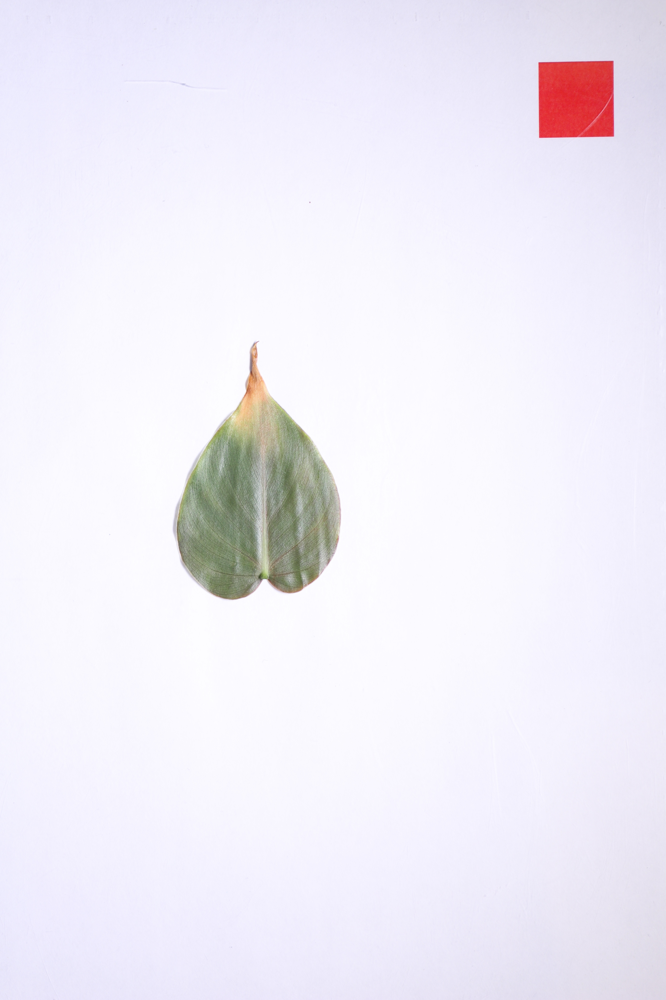

<!-- README.md is generated from README.Rmd. Please edit that file -->

```{r, include = FALSE}
library(tidyverse)
library(rhleaves)

knitr::opts_chunk$set(
  collapse = TRUE,
  comment = "#>",
  fig.path = "man/figures/README-",
  out.width = "100%"
)
```

# rhleaves


<!-- badges: start -->
<!-- badges: end -->

The goal of rhleaves is to provide a dataset that can be used to illustrate data exploration and analysis in a variety of courses.

```{r, echo=FALSE, eval=TRUE, fig.alt='Scatterplot with area on the y-axis and the area of the bounding box on the x-axis. There is a strong positive correlation.'}
ggplot(rhleaves) +
  aes(y = `Supervised Area`,
      x = Length * Width) +
  geom_point() +
  labs(
    y = expression(paste('Area of Leaf (', cm^2, ')')),
    x = 'Product of Length (cm) and Width (cm) of Leaf',
    subtitle = 'Relationship between area of a leaf and its bounding box across species.'
  ) +
  theme_minimal() 
```

```{r, echo=FALSE, eval=TRUE, fig.alt='Overlapping densities of the leaf area for each species; each species is in a different color. Schefflera Luseane has much smaller leaves while Silver Satin Pothos has much larger leaves.'}
ggplot(rhleaves) +
  aes(x = `Supervised Area`, fill = Species) +
  geom_density(color = NA, alpha = 0.5) +
  labs(
    x = expression(paste('Area of Leaf (', cm^2, ')')),
    y = NULL,
    fill = NULL,
    subtitle = 'Distribution of leaf area across various species.'
  ) +
  theme_minimal() +
  theme(legend.position = 'bottom',
        axis.ticks.y = element_blank(),
        axis.text.y = element_blank())
```


## Installation

You can install the development version of rhleaves like so:

``` r
# install.packages("remotes")
remotes::install_github("reyesem/rhleaves")
```

## About the Data
Data are the result of a study designed by students in a Biostatistics course at Rose-Hulman Institute of Technology to characterize the plants growing on two "living walls" installed on campus. 

The primary dataset in the `rhleaves` package is the `rhleaves` dataset.

``` r
library(rhleaves)
data(package = 'rhleaves')
```

```{r}
head(rhleaves)
```

The `rhleaves` dataset contains measurements taken on individual leaves from seven species. In addition to these measurements, a photograph of each leaf was taken. Below is the image of the first leaf in the dataset.

```{r, echo=FALSE, eval=TRUE, fig.alt='The photo of a Philodendron Cordatum leaf from the living wall in Moench; this is the first observation in the rhleaves dataset.'}


```

The photos are stored in a zipped folder and accompany the package. There are three versions of photos:

- `original-images.zip` contains the original photos taken of each leaf.
- `oriented-images.zip` contains the original photos, but each has been oriented in the same direction with a calibration square in the upper-right corner of the photo.
- `extracted-images.zip` contains a version of the photo with the leaf extracted using photo software; that is, the background of the image has been removed.

The following code would unzip the "extracted images" to a folder called `extracted-images` in your current working directory.

``` r
system.file('extdata', 'extracted-images.zip', package = 'rhleaves') |>
  unzip(exdir = 'extracted-images')
```

These images might be used to illustrate extracting data from images or as data for training a machine learning algorithm. The images are presented in the same order as the observations in the `rhleaves` dataset.

A full description of the data can be found in the _Description of Data Collection_ article on this site.

## Example
The `rhleaves` dataset is meant to useful in illustrating a wide range of statistical applications. For data management, we can compare various species:

```{r example-management, message=FALSE}
library(rhleaves)
library(tidyverse)

rhleaves |>
  group_by(Species) |>
  summarise(
    `Mean Leaf Area` = mean(`Supervised Area`),
    .groups = 'drop'
  )
```


Introductory courses could consider various linear regression models. For example, a model of the form

$$(\text{Supervised Area})_i = \beta_0 + \beta_1 (\text{Unsupervised Area})_i + \varepsilon_i.$$

If we believe the "supervised area" to be the more accurate measure, this model might shed light on whether the algorithm implemented for determining the area from the original images should be calibrated.

```{r example-lm}
lm(`Supervised Area` ~ 1 + `Unsupervised Area`, data = rhleaves) |>
  summary()
```

```{r}
ggplot(rhleaves) +
  aes(x = `Unsupervised Area`,
      y = `Supervised Area`) +
  geom_point() +
  geom_smooth(method = 'lm', formula = y ~ x) +
  labs(
    y = "Area of Leaf\nfrom Supervised Process",
    x = "Area of Leaf\nfrom Unsupervised Process"
  ) +
  theme_minimal()
```

A second course in statistics might consider a linear regression of the form

$$\ln(\text{Supervised Area})_i = \beta_0 + \beta_1 \ln(\text{Length})_i + \beta_2\ln(\text{Width})_i + \varepsilon_i$$

to predict the area of a leaf as a function of its length and width. Alternatively, if you are examining nonlinear models, this might be fit on the original scale with a model of the form

$$
\begin{aligned}
  E\left[(\text{Supervised Area})_i \mid (\text{Length})_i, (\text{Width})_i\right]
    &= \gamma_0 (\text{Length})_i^{\gamma_1} (\text{Width})_i^{\gamma_2} \\
  Var\left[(\text{Supervised Area})_i \mid (\text{Length})_i, (\text{Width})_i\right]
    &= \sigma^2.
\end{aligned}
$$

```{r example-nls}
nlsform <- `Supervised Area` ~ g0 * (Length)^(g1) * (Width)^(g2)

nls(nlsform, data = rhleaves, start = c('g0' = 0.5, 'g1' = 0.9, 'g2' = 1)) |>
  summary()
```

Of course, it is likely these relationships differ across each species and that might be incorporated as well.

The images could be used, alongside a package like [`imager`](https://asgr.github.io/imager/), to illustrate extracting data from images or writing functions in a statistical computing course.

```{r example-imager, eval=FALSE}
# install.packages("imager")
library(imager)

# Unzip images ----
system.file('extdata', 'extracted-images.zip', package = 'rhleaves') |>
  unzip(exdir = 'extracted-images')

# Load images ----
leaf1 <- load.image('extracted-images/IMG_001.PNG')

# Plot image ----
plot(leaf1)

# Area of leaf (in pixels) ----
sum(leaf1 > 0)
```


## Citation
To cite the `rhleaves` package, please use

```{r}
citation("rhleaves")
```

