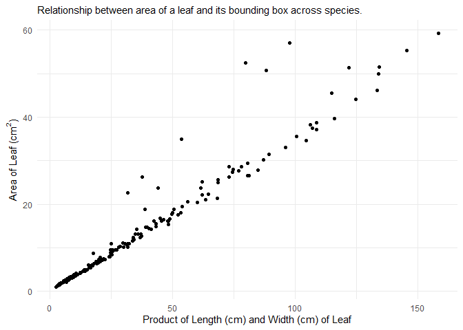
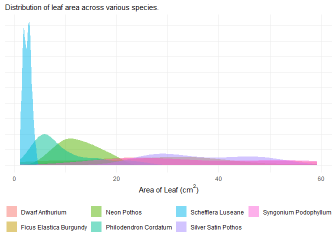
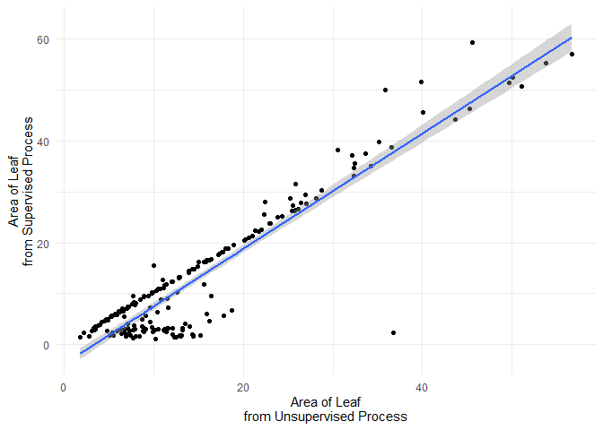

<!-- README.md is generated from README.Rmd. Please edit that file -->

# rhleaves

<!-- badges: start -->

<!-- badges: end -->

The goal of rhleaves is to provide a dataset that can be used to
illustrate data exploration and analysis in a variety of courses.





## Installation

You can install the development version of rhleaves like so:

``` r
# install.packages("remotes")
remotes::install_github("reyesem/rhleaves")
```

## About the Data

Data are the result of a study designed by students in a Biostatistics
course at Rose-Hulman Institute of Technology to characterize the plants
growing on two “living walls” installed on campus.

The primary dataset in the `rhleaves` package is the `rhleaves` dataset.

``` r
library(rhleaves)
data(package = 'rhleaves')
```

``` r
head(rhleaves)
#> # A tibble: 6 × 14
#>   Wall   Location   Species      `Stem Diameter`  Mass Length Width `Image Name`
#>   <chr>  <chr>      <chr>                  <dbl> <dbl>  <dbl> <dbl> <chr>       
#> 1 Moench Upper Left Philodendro…             1.6  0.39    6.3   4.3 IMG001      
#> 2 Moench Upper Left Philodendro…             1.3  0.27    5.3   3.5 IMG002      
#> 3 Moench Upper Left Philodendro…             1.8  0.3     5.4   3.5 IMG003      
#> 4 Moench Upper Left Ficus Elast…             3.9  3.51   12.1   7.2 IMG004      
#> 5 Moench Upper Left Ficus Elast…             3.2  1.69    9     4.7 IMG005      
#> 6 Moench Upper Left Ficus Elast…             4.2  3.16   13.6   8   IMG006      
#> # ℹ 6 more variables: `Supervised Length` <dbl>, `Supervised Width` <dbl>,
#> #   `Supervised Area` <dbl>, `Unsupervised Length` <dbl>,
#> #   `Unsupervised Width` <dbl>, `Unsupervised Area` <dbl>
```

The `rhleaves` dataset contains measurements taken on individual leaves
from seven species. In addition to these measurements, a photograph of
each leaf was taken. Below is the image of the first leaf in the
dataset.


The photos are stored in a zipped folder and accompany the package.
There are three versions of photos:

- `original-images.zip` contains the original photos taken of each leaf.
- `oriented-images.zip` contains the original photos, but each has been
  oriented in the same direction with a calibration square in the
  upper-right corner of the photo.
- `extracted-images.zip` contains a version of the photo with the leaf
  extracted using photo software; that is, the background of the image
  has been removed.

The following code would unzip the “extracted images” to a folder called
`extracted-images` in your current working directory.

``` r
system.file('extdata', 'extracted-images.zip', package = 'rhleaves') |>
  unzip(exdir = 'extracted-images')
```

These images might be used to illustrate extracting data from images or
as data for training a machine learning algorithm. The images are
presented in the same order as the observations in the `rhleaves`
dataset.

A full description of the data can be found in the *Description of Data
Collection* article on this site.

## Example

The `rhleaves` dataset is meant to useful in illustrating a wide range
of statistical applications. For data management, we can compare various
species:

``` r
library(rhleaves)
library(tidyverse)

rhleaves |>
  group_by(Species) |>
  summarise(
    `Mean Leaf Area` = mean(`Supervised Area`),
    .groups = 'drop'
  )
#> # A tibble: 7 × 2
#>   Species                 `Mean Leaf Area`
#>   <chr>                              <dbl>
#> 1 Dwarf Anthurium                    33.6 
#> 2 Ficus Elastica Burgundy            26.4 
#> 3 Neon Pothos                        12.6 
#> 4 Philodendron Cordatum               9.49
#> 5 Schefflera Luseane                  2.46
#> 6 Silver Satin Pothos                36.9 
#> 7 Syngonium Podophyllum              35.8
```

Introductory courses could consider various linear regression models.
For example, a model of the form

$$(\text{Supervised Area})_i = \beta_0 + \beta_1 (\text{Unsupervised Area})_i + \varepsilon_i.$$

If we believe the “supervised area” to be the more accurate measure,
this model might shed light on whether the algorithm implemented for
determining the area from the original images should be calibrated.

``` r
lm(`Supervised Area` ~ 1 + `Unsupervised Area`, data = rhleaves) |>
  summary()
#> 
#> Call:
#> lm(formula = `Supervised Area` ~ 1 + `Unsupervised Area`, data = rhleaves)
#> 
#> Residuals:
#>     Min      1Q  Median      3Q     Max 
#> -35.392  -2.141   1.782   2.950  13.224 
#> 
#> Coefficients:
#>                     Estimate Std. Error t value Pr(>|t|)    
#> (Intercept)         -3.75225    0.59786  -6.276 2.15e-09 ***
#> `Unsupervised Area`  1.12892    0.03247  34.768  < 2e-16 ***
#> ---
#> Signif. codes:  0 '***' 0.001 '**' 0.01 '*' 0.05 '.' 0.1 ' ' 1
#> 
#> Residual standard error: 5 on 198 degrees of freedom
#> Multiple R-squared:  0.8593, Adjusted R-squared:  0.8585 
#> F-statistic:  1209 on 1 and 198 DF,  p-value: < 2.2e-16
```

``` r
ggplot(rhleaves) +
  aes(x = `Unsupervised Area`,
      y = `Supervised Area`) +
  geom_point() +
  geom_smooth(method = 'lm', formula = y ~ x) +
  labs(
    y = "Area of Leaf\nfrom Supervised Process",
    x = "Area of Leaf\nfrom Unsupervised Process"
  ) +
  theme_minimal()
```



A second course in statistics might consider a linear regression of the
form

$$\ln(\text{Supervised Area})_i = \beta_0 + \beta_1 \ln(\text{Length})_i + \beta_2\ln(\text{Width})_i + \varepsilon_i$$

to predict the area of a leaf as a function of its length and width.
Alternatively, if you are examining nonlinear models, this might be fit
on the original scale with a model of the form

$$
\begin{aligned}
  E\left[(\text{Supervised Area})_i \mid (\text{Length})_i, (\text{Width})_i\right]
    &= \gamma_0 (\text{Length})_i^{\gamma_1} (\text{Width})_i^{\gamma_2} \\
  Var\left[(\text{Supervised Area})_i \mid (\text{Length})_i, (\text{Width})_i\right]
    &= \sigma^2.
\end{aligned}
$$

``` r
nlsform <- `Supervised Area` ~ g0 * (Length)^(g1) * (Width)^(g2)

nls(nlsform, data = rhleaves, start = c('g0' = 0.5, 'g1' = 0.9, 'g2' = 1)) |>
  summary()
#> 
#> Formula: `Supervised Area` ~ g0 * (Length)^(g1) * (Width)^(g2)
#> 
#> Parameters:
#>    Estimate Std. Error t value Pr(>|t|)    
#> g0  0.53867    0.03307   16.29  < 2e-16 ***
#> g1  0.13084    0.03815    3.43 0.000736 ***
#> g2  1.86000    0.03931   47.31  < 2e-16 ***
#> ---
#> Signif. codes:  0 '***' 0.001 '**' 0.01 '*' 0.05 '.' 0.1 ' ' 1
#> 
#> Residual standard error: 1.823 on 197 degrees of freedom
#> 
#> Number of iterations to convergence: 6 
#> Achieved convergence tolerance: 5.445e-06
```

Of course, it is likely these relationships differ across each species
and that might be incorporated as well.

The images could be used, alongside a package like
[`imager`](https://asgr.github.io/imager/), to illustrate extracting
data from images or writing functions in a statistical computing course.

``` r
# install.packages("imager")
library(imager)

# Unzip images ----
system.file('extdata', 'extracted-images.zip', package = 'rhleaves') |>
  unzip(exdir = 'extracted-images')

# Load images ----
leaf1 <- load.image('extracted-images/IMG_001.PNG')

# Plot image ----
plot(leaf1)

# Area of leaf (in pixels) ----
sum(leaf1 > 0)
```

## Citation

To cite the `rhleaves` package, please use

``` r
citation("rhleaves")
#> To cite package 'rhleaves' in publications use:
#> 
#>   Reyes E (2025). _rhleaves: Leaf attributes from plants at Rose-Hulman
#>   Institute of Technology_. R package version 0.1.0,
#>   <https://reyesem.github.io/rhleaves/>.
#> 
#> A BibTeX entry for LaTeX users is
#> 
#>   @Manual{,
#>     title = {rhleaves: Leaf attributes from plants at Rose-Hulman Institute of Technology},
#>     author = {Eric Reyes},
#>     year = {2025},
#>     note = {R package version 0.1.0},
#>     url = {https://reyesem.github.io/rhleaves/},
#>   }
```
