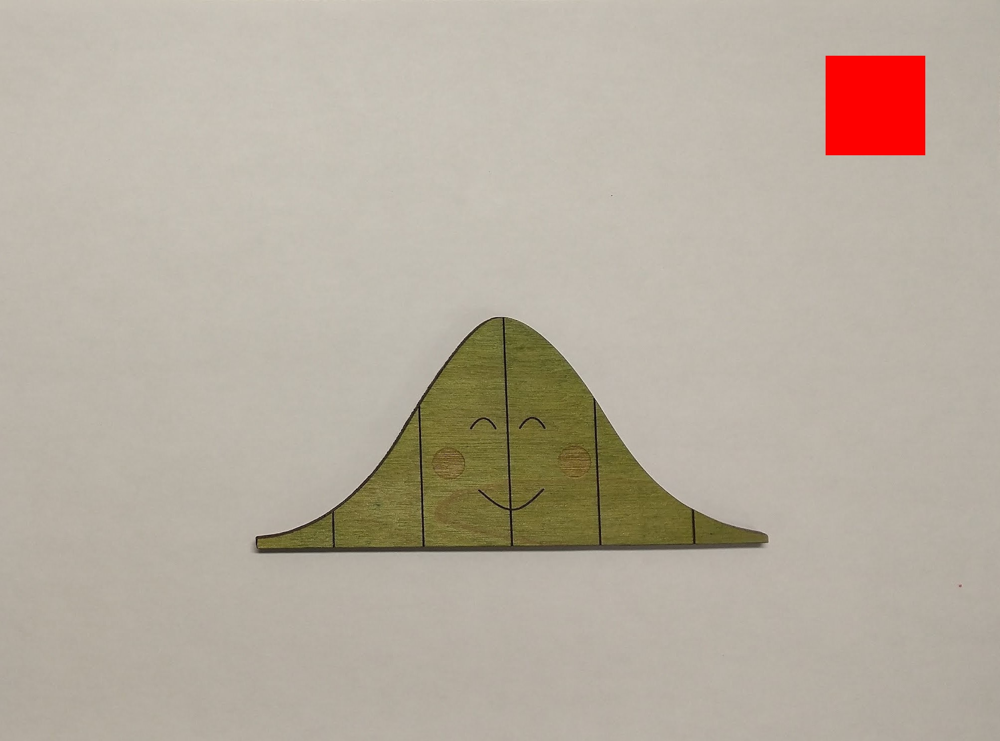

```{r setup, include = FALSE}
knitr::opts_chunk$set(
  collapse = TRUE,
  comment = "##"
)

library(ggplot2)
```


## Background
This vignette describes how the function `leaf_dimensions()` computes the leaf attributes from an image.  We assume the image has the following properties:

  - The background of the image is a solid, light color.  We recommend using a sheet of printer paper.
  - A red "calibration" square appears in the image.
  - The top of the calibration square is parallel to the side of the image; this is necessary for determining length and width from the image but not for computing area.
  - The leaf is oriented either vertically or horizontally in the image; this is necessary for determining the length and width from the image but not for computing area.  We define "length" as the vertical distance and "width" as the horizontal distance.
  
Figure 1 illustrates an image conforming to these properties.

```{r fig-demo, echo=FALSE, fig.cap="Figure 1: The Normal leaf is arranged so that the midrib is vertical in the image, and a red calibration square appears with the top of the square parallel to the top of the image.", out.width="75%"}


```

The `imager` package is used to do the heavy lifting.  


## Leaf Attributes
The `imager` package makes use of pixsets; these are logical arrays that describe which pixels in an image are within the set.  When plotted, pixels that appear within the set are white and pixels outside of the set are black; it is like looking at a negative of a photograph.  Figure 2 illustrates a pixset for a hypothetical "Normal" leaf.  

```{r fig-pixel-distance, echo=FALSE, fig.cap="Figure 2: Illustration of a pixset with annotated dimensions.", out.width="75%"}
data.frame(
  x = seq(from = -2, to = 2, length.out = 1000),
  y = dnorm(seq(from = -2, to = 2, length.out = 1000))
) |>
  ggplot() +
  aes(y = y, x = x) +
  geom_area(fill = 'white') +
  annotate(
    'segment', 
    x = 0, xend = 0,
    y = 0, yend = dnorm(0),
    lineend = 'round',
    linejoin = 'round',
    arrow = arrow(ends = 'both', length = unit(0.03, 'npc')),
    color = 'darkred',
    linewidth = 1
  ) +
  annotate(
    'label',
    x = 0, y = 0.5 * dnorm(0),
    label = 'Length = 479 px',
    color = 'darkred'
  ) +
  annotate(
    'segment',
    x = -2, xend = 2,
    y = 0.5 * dnorm(-2), yend = 0.5 * dnorm(2),
    lineend = 'round',
    linejoin = 'round',
    arrow = arrow(ends = 'both', length = unit(0.03, 'npc')),
    color = 'darkblue',
    linewidth = 1
  ) +
  annotate(
    'label',
    x = 1.125, y = 0.5 * dnorm(2),
    label = 'Width = 1779 px',
    color = 'darkblue'
  ) +
  annotate(
    'label',
    x = -1.5, y = 0.4,
    label = 'Area = 509703 px',
    color = 'black'
  ) +
  expand_limits(y = c(-0.5, 0.75), x = c(-2.5, 2.5)) +
  theme_classic() +
  theme(
    panel.background = 
      element_rect(fill = 'black', linewidth = 0)) +
  labs(y = NULL,
       x = NULL) +
  scale_y_continuous(breaks = seq(-0.5, 0.75, 0.25), 
                     labels = seq(1500, 0, -300)) +
  scale_x_continuous(breaks = seq(-2.25, 2.25, 1.125),
                     labels = seq(0, 2000, 500))
```

The "length" is the longest vertical distance (generally along the midrib of the leaf).  For each column of pixels in the image, we find the largest and smallest indices belonging to the pixset and take the difference; the largest of these differences is the "length."  Similarly, the "width" is the longest horizontal distance.  For each row of pixels in the image, we find the largest and smallest indices belonging to the pixset and take the difference; the largest of these differences is the "width."  The area is the total number of pixels in the pixset.


## Determining the Calibration Scaling
The calibration square is isolated by looking for a portion of the image that is red.  Each pixel in the image has an RGB representation.  The calibration square is determined by identifying pixels that have a large R component and small B and G components.  For example, for image `im`, we might identify the red square as having an R component larger than 0.8 and B and G components smaller than 0.6:

```{r, echo=TRUE, eval=FALSE}
redsquare <- (imager::R(im) > 0.8) & 
  (imager::G(im) < 0.6) & 
  (imager::B(im) < 0.6)
```

The result is a pixset the same size as the original image identifying the pixels belonging to the calibration square.  We can then determine the dimensions of the calibration square in pixels and relate it to known real-world measurements.

It is important that the calibration square be starkly different than the background of the image and the leaf itself.


## Isolating the Leaf
The calibration square is removed from the image (those pixels are set to "white").  The image is then converted to grayscale and a median filter is applied.  The median filter smooths out the image; in particular, the blurring will result in the background being lightened compared to the leaf, allowing the leaf to stand out.  We then identify all pixels in the grayscale that have high luminescence (capturing the background) and set those pixels to 1; the negative of this pixset is the leaf itself.  We also look for any pixels in the original image where the green value is larger than the red or blue values (in the RGB specification).  Any pixels belonging to either approach are considered in the set.  We then clean this set up.  

Given a cropped image `im`, this is done as follows:

```{r, echo=TRUE, eval=FALSE}
# find green region
greenarea <- (imager::G(im) > imager::R(im)) &
  (imager::G(im) > imager::B(im))

# find light area (background)
lightarea <- im |> imager::grayscale()
lightarea[redsquare] <- 1

lightarea <- lightarea |>
  imager::medianblur(n = 10, threshold = 0.5) |>
  imager::threshold(0.8)

# leaf area
onlyleaf <- (greenarea | (!lightarea)) |>
  imager::clean(25) |>
  imager::fill(25)
```

Of course, the above assumes we are working with the original image.  If the leaf has already been isolated from the image using other software, we can simply extract this from the PNG file as follows.

```{r, echo=TRUE, eval=FALSE}
# assuming PNG created of only leaf
onlyleaf <- (imager::channel(im, 4) > 0)
```

Regardless of our approach, using the resulting pixset, we can then compute the attributes of the leaf as described above and scale to real-world measurements using the attributes of the calibration square.
