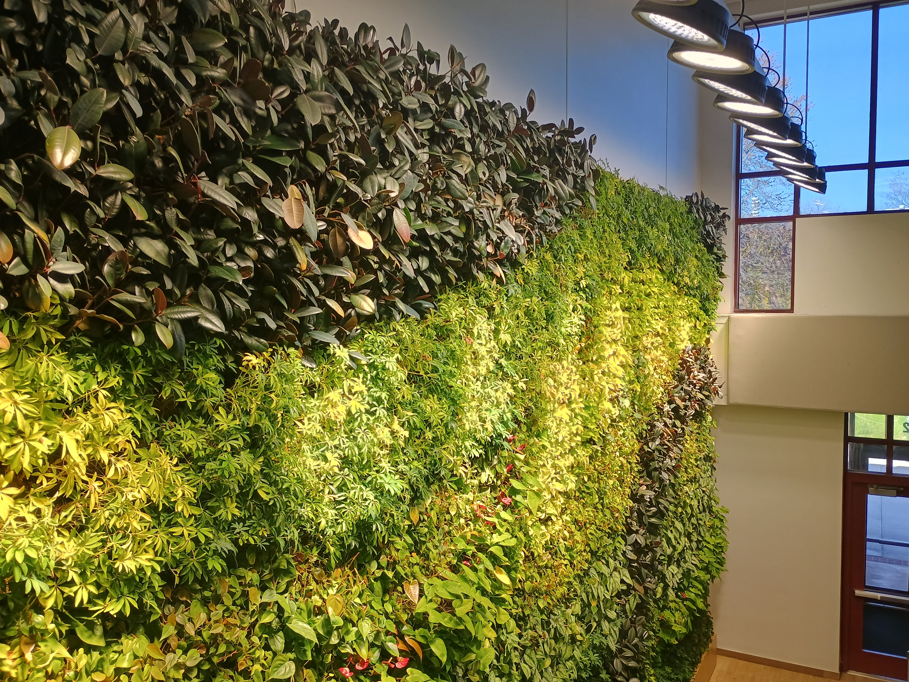

```{r setup, include = FALSE}
knitr::opts_chunk$set(
  collapse = TRUE,
  comment = "##"
)
```

## Background
[Rose-Hulman Institute of Technology](https://www.rose-hulman.edu) focuses on undergraduate science and engineering education.  Rose-Hulman maintains two "living walls" on campus, one in the academic space and another in the union.

```{r fig-living-walls, echo=FALSE, fig.cap="Figure 1: The living wall located in Moench Hall, an academic space on the Rose-Hulman campus.", fig.show="hold", out.width="75%"}


```

Each wall is comprised of a mosaic of species:

  - Dwarf Anthurium
  - Ficus Elastica Burgundy
  - Neon Pothos
  - Philodendron Cordatum
  - Schefflera Luseane
  - Silver Satin Pothos
  - Syngonium Podophyllum (only present on wall located in the Union)
  
Each living wall is approximately 255 square feet consisting of nearly 1500 potted plants.  An automated system provides water and nutrients to each plant.[^facebookpost]  The walls are lit to promote growth, but each is also situated next to a southward facing wall that is comprised largely of windows.

With the exception of _syngonium podophyllum_, each of the plants on the wall has almond-shaped or heart-shaped leaves. A 2020 article in _Global Ecology and Conservation_[^originalpaper] described various formulas for approximating the area of an almond-shaped leaf based on its length and width.  All the formulas considered are a special case of the nonlinear model

$$(\text{Area}) = \beta_0 (\text{Length})^{\beta_1} (\text{Width})^{\beta_2}.$$

Of course, we might also consider taking the natural logarithm of both sides, resulting in

$$\ln(\text{Area}) = \gamma_0 + \beta_1 \ln(\text{Length}) + \beta_2 \ln(\text{Width}),$$

where $\gamma_0 = \ln\left(\beta_0\right)$.  

In the Spring of 2025, the members of the Biostatistics course designed and carried out a study to investigate the relationship between the area of a leaf and its other attributes for plants grown on the living walls located on the Rose-Hulman campus.

[^facebookpost]: See the [post on social media](https://www.facebook.com/rosehulman/posts/the-living-wall-from-gsky-plant-systems-has-been-installed-255-square-feet-1458-/10155185657401302/)

[^originalpaper]: Jiayan He, Gadi V.P. Reddy, Mengdi Liu, Peijian Shi. "A general formula for calculating surface area of the similarly shaped leaves: Evidence from six Magnoliaceae species." _Global Ecology and Conservation_ Volume 23, 2020. <https://doi.org/10.1016/j.gecco.2020.e01129>


## Study Design and Attribute Measurement
The living walls are serviced each week, with a larger trim scheduled every other week.  Data collection was coordinated with the biweekly trim.  The technician followed their standard protocol using their expert judgement to determine which plants should be trimmed to promote growth.  As a result, this maintenance removes both dead and healthy leaves.  The leaf cuttings were allowed to fall to the floor where they were collected in one of eight bags according to their original location (the Moench or Union wall, the upper or lower portion of the wall, the right or left side of the wall)[^location].

Leaves that were obviously damaged (large holes) or decaying (dried out, brown, etc.) were discarded.  Among the remaining cuttings, leaves were chosen haphazardly from each variety within each bag.  The species of each leaf was identified by sight using online photographs for reference.  The diameter (millimeters) of the stem at the base of the leaf was measured using an Esydon digital caliper.  The stem was then removed from the leaf.  The mass (grams) of the leaf was obtained using an Ohaus YA Series digital scale.  The length (nearest millimeter) of the leaf along its midrib was obtained using a clear ruler.  For leaves belonging to the _silver satin pothos_ species, the midrib has a pronounced curvature.  For this species, each leaf was oriented with tip of the leaf upward and the longest vertical distance between the tip and the base of the leaf was defined to be the length.  The width (nearest millimeter) of the leaf was defined to be the widest point of the leaf perpendicular to the length; this was also measured using a clear ruler. 

The leaf was then photographed using a Canon EOS 6D Mark II camera.  The camera was placed on the "Food Scene" with the brightness set to the maximum setting and the color tone adjusted to the "cool" extreme.  The camera was placed on a tripod; all photos were taken from the same distance.  The leaf was photographed against a sheet of plain white printer paper that contained a red 4 $cm^2$ calibration square.  A thin piece of plexiglass was placed over the leaf to flatten it as much as possible.  All leaves were oriented such that the length of the leaf ran in the same direction as the sheet of printer paper.  The order of the photos corresponds to the order of the leaves presented in the dataset; these are known as the "original images."

Leaf attributes were extracted from the image using a custom R script relying on the `imager` package (see the `Computing Leaf Attributes` vignette).  Prior to running the script, we oriented all images so that the calibration square appeared in the same location (top right corner of the image).  This is known as the "oriented image."  The values extracted using the custom script are called the `Unsupervised Length`, `Unsupervised Width`, and `Unsupervised Area` since they were computed in batch using the same settings across all images.  We also used a more interactive approach.  Each photo was opened in Microsoft Photos; we used the "Background" editing feature to automatically identify the background of the image.  The calibration square was manually added to the background, and then the "Remove Background" option was selected in Microsoft Photos, and the image was saved as a PNG.  These are known as the "extracted images."  No attempt was made to remove shadows if they were selected as part of the leaf.  The dimensions of the leaf were taken from these extracted images; these are known as the `Supervised Length`, `Supervised Width`, and `Supervised Area` as the removal of the background was manually supervised on each image.

[^location]: Lights to stimulate growth are located at the top of each wall.  The wall in Moench Hall has a wall on its _right_ side with several windows that let in natural light.  The wall in the Union has a wall on its _left_ side with several windows that let in natural light.  These factors may be important if plants closer to a light source behave differently.


## Limitations
As all measurements were taken from leaf cuttings, and the technician used their expert judgement in determining which leaves should be cut, some species were more prominent among the cuttings than others.  We noted, for example, that _philodendron cordatum_, a vine that can crowd out the other plants on the wall, was heavily represented in all locations; however, _silver satin pothos_ was much less likely to appear.  Plants with smaller leaves, such as _philodendron cordatum_ and _schefflera luseane_ also offered more choices for inclusion in the study compared to species with larger leaves.  

All photographs were taken inside.  To improve the lighting, a portable LED light was used.  However, it was not possible to place this light directly over the leaf without causing a shadow from the camera.  The placement of the light resulted in a small shadow on some images.  While a plexiglass sheet was placed on the leaf to make it flat, some leaves were less malleable and did not lay flat, resulting in a more prominent shadow.

While the camera was placed on a tripod, the internal sensors caused some images to be oriented differently than others.  All photos were opened in Paint and oriented such that the red calibration square appeared in the top right corner of the image.


## Special Thanks
The Spring 2025 Biostatistics class at Rose-Hulman Institute of Technology conceived of the study design.  These students, listed alphabetically, included

  - Anahita Adhikari (Biology)
  - Catherine Arrandale (Biomedical Engineering)
  - Ethan Bernstein (Mathematics)
  - Tommaso Calviello (Biomedical Engineering & Data Science)
  - Gracie Ferguson (Biology)
  - Nicholas Fong (Mechanical Engineering)
  - Hanshuo Geng (Computer Science & Mathematics)
  - Jacob Gerber (Mathematics)
  - Jonathan Gollapudi (Biomedical Engineering)
  - Natalie Hannum (Biomedical Engineering)
  - Lauren Jaracz (Engineering Design & Mechanical Engineering)
  - Allison Kirk (Biomedical Engineering)
  - Gage Knowles (Civil Engineering)
  - Hanlin Lyu (Biomedical Engineering)
  - Alyssa McGauley (Biomedical Engineering)
  - Angela Milkowski (Biomathematics & Chemical Engineering)
  - Alexander Nustad (Mechanical Engineering)
  - Kyle Peng (Computer Science)
  - Ellen Shales (Biomedical Engineering)
  - Quinlan Walinder (Engineering Design)
  - Colin Wilson (Biochemistry)
  - Christina Wu (Biology)
  
The living walls are maintained by the Engledow Group; we thank Daria Caldwell, the technician who services the wall for her help in collecting specimens.  And, we also thank Jamie Reyes (M.Stat.) for her help in the data collection.  
